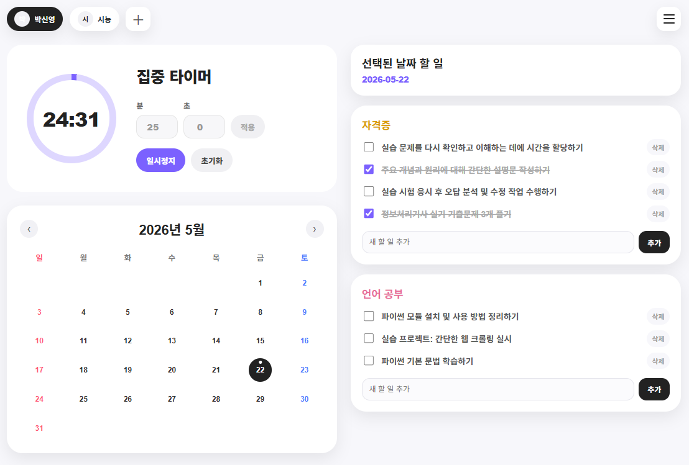
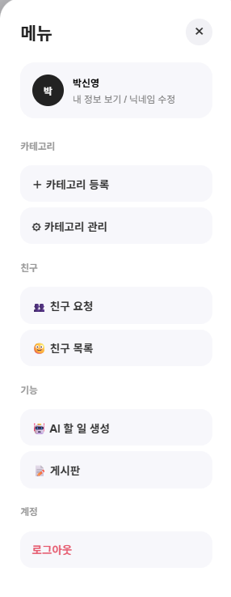
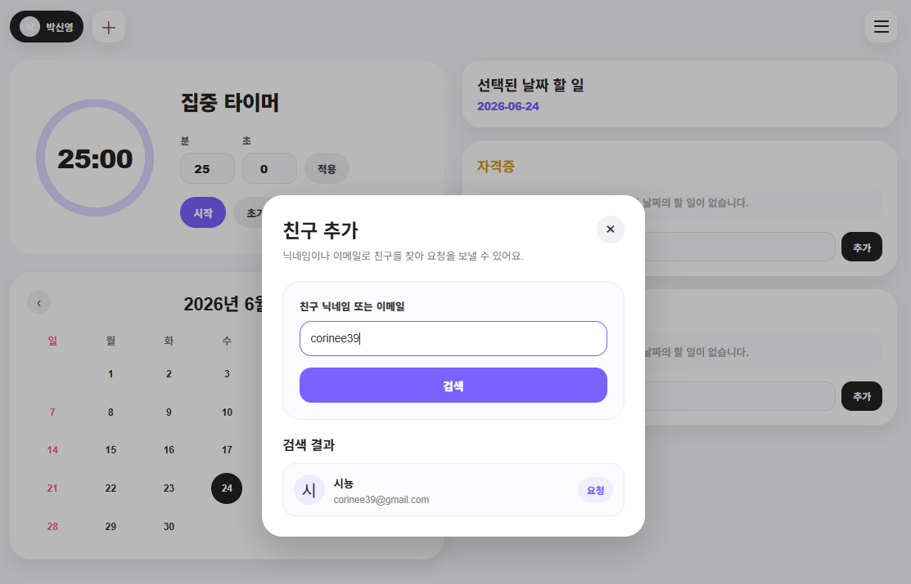
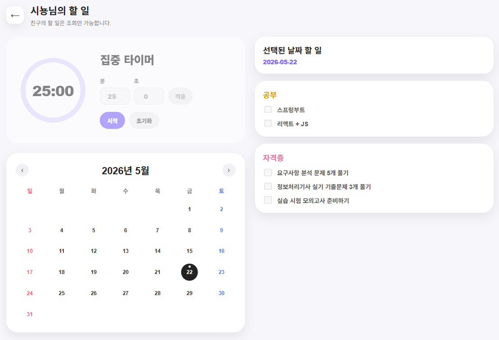
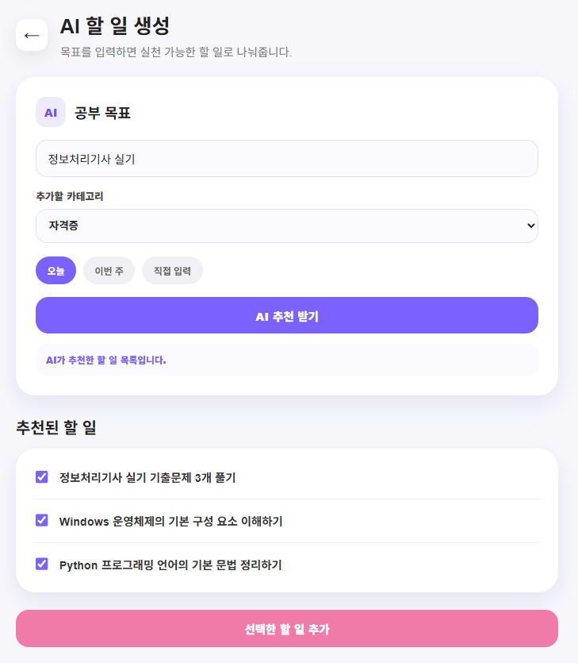

# 개발자를 위한 TodoList 서비스

**PKNU 2026 자바개발자 과정 토이프로젝트**

개발자가 자신의 학습/개발 업무/프로젝트 작업을 효율적으로 관리할 수 있도록 할 일을 등록/관리하는 투두리스트 서비스<br>
단순 할 일 관리에 더해 **달력 기반 일정 조회**, **할 일 타이머**, **친구의 투두리스트 열람**, **커뮤니티 게시판**, **AI를 활용한 할 일 자동 생성** 기능을 제공

---

## 주요 기능

| 영역      | 기능                                                                         |
| --------- | ---------------------------------------------------------------------------- |
| 회원      | 카카오 / 구글 소셜 로그인, 내 정보 조회, 닉네임 수정, 회원 탈퇴              |
| 할 일     | 등록·조회·수정·삭제, 상태(대기/진행 중/완료) 및 우선순위 관리, 카테고리 분류 |
| 카테고리  | 사용자별 할 일 카테고리 등록·수정·삭제                                       |
| 달력      | 월별 달력 조회, 날짜별 할 일 조회, 할 일 존재/완료 상태 표시                 |
| 타이머    | 선택한 할 일에 대해 타이머 실행 (프런트엔드에서 관리)                        |
| 친구      | 사용자 검색, 친구 요청·수락·거절, 친구 목록 조회·삭제                        |
| 친구 투두 | 친구의 투두리스트 **조회 전용** (수정·삭제·타이머 불가)                      |
| 커뮤니티  | 게시글 등록·조회·수정·삭제, 댓글, 검색, 카테고리 필터                        |
| AI        | 목표를 입력하면 LLM이 실행 가능한 할 일 목록을 자동 생성                     |

- 메인 화면<br>
  

- 사이드바 메뉴<br>
  

- 친구 추가<br>
  

- 친구 Todo 조회<br>
  

- AI 할 일 생성<br>
  

### 핵심 정책

- **소유권 검증**: 할 일·게시글·댓글은 작성자 본인만 수정·삭제할 수 있으며, 서버에서 본인 여부를 검증합니다.
- **친구 투두 권한**: 친구의 투두리스트는 조회만 가능하고 등록·수정·삭제·타이머는 불가능합니다.
- **소프트 삭제**: 데이터를 실제로 지우지 않고 `status`와 `deleted_at`으로 삭제 상태를 관리합니다.

---

## 기술 스택

### 백엔드

- **Java 17**, **Spring Boot 3.5.14**
- **Spring Security** + **JWT** (`jjwt 0.13.0`) — Stateless 인증
- **MyBatis** (`mybatis-spring-boot-starter 3.0.5`) — XML 매퍼 기반 SQL 매핑
- **Oracle Database** (`ojdbc11`)
- **Spring Boot Validation** — 요청 검증
- **Gradle** 빌드

### 프런트엔드

- **React 19** + **Vite 8**
- **React Router 7** — SPA 라우팅
- `fetch` 기반 HTTP 클라이언트, `localStorage`에 액세스 토큰 보관

### AI

- **Ollama** + **`qwen2.5:3b`** 로컬 모델 — 목표 기반 할 일 생성

---

## 프로젝트 구조

```
todo_list/
├── backend/                         # Spring Boot 서버
│   └── src/main/java/com/bwsy/todolist/
│       ├── auth/                    # 소셜 로그인(카카오/구글), JWT 발급
│       ├── config/                  # Security, Web(CORS) 설정
│       ├── controller/              # REST 컨트롤러
│       ├── service/                 # 비즈니스 로직 (AI 포함)
│       ├── mapper/                  # MyBatis 매퍼 인터페이스
│       ├── dto/                     # 요청/응답 DTO
│       ├── security/                # JWT 필터·프로바이더, 인증 주체
│       └── validation/              # 요청 검증용 객체
│   └── src/main/resources/
│       ├── application.properties
│       └── mapper/*.xml             # MyBatis SQL 매퍼
│
├── frontend/                        # React + Vite 클라이언트
│   └── src/
│       ├── api/                     # 백엔드 API 호출 모듈
│       ├── components/              # calendar·friend·layout·timer·todo
│       └── pages/                   # 화면 단위 페이지
│
└── docs/                            # 설계 문서

```

---

## 데이터베이스 설계

DBMS는 **Oracle** 기준이며, 모든 테이블은 소프트 삭제(`status` + `deleted_at`)를 적용합니다.

| 테이블            | 설명                                                                          |
| ----------------- | ----------------------------------------------------------------------------- |
| `users`           | 사용자 정보 (소셜 로그인 기반: `provider`, `provider_id`)                     |
| `todos`           | 할 일 (상태: `WAITING`/`IN_PROGRESS`/`DONE`, 우선순위: `HIGH`/`MEDIUM`/`LOW`) |
| `todo_categories` | 사용자별 할 일 카테고리 (`UNIQUE(user_id, name)`)                             |
| `friends`         | 친구 요청·관계 (`PENDING`/`ACCEPTED`/`REJECTED`/`DELETED`)                    |
| `posts`           | 커뮤니티 게시글 (`FREE`/`QUESTION`/`TIP`/`STUDY`/`ERROR`)                     |
| `comments`        | 게시글 댓글                                                                   |

자세한 컬럼 정의와 관계는 [docs/DB/todolist_table_design.md](docs/DB/todolist_table_design.md)와 [ERD](docs/DB/ERD.png)를 참고하세요.

---

## API 개요

REST API는 `GET`(조회)과 `POST`(등록·수정·삭제)만 사용하는 단순한 규칙을 따릅니다. 모든 경로는 `/api` 하위에 있습니다.

| 영역      | 대표 엔드포인트                                                                                         |
| --------- | ------------------------------------------------------------------------------------------------------- |
| 인증      | `POST /api/auth/kakao`, `POST /api/auth/google`                                                         |
| 회원      | `GET /api/members/me`, `POST /api/members/me/update`, `POST /api/members/me/delete`                     |
| 할 일     | `GET /api/todos?date=`, `POST /api/todos`, `POST /api/todos/{id}/update`, `POST /api/todos/{id}/delete` |
| 카테고리  | `GET /api/todo-categories`, `POST /api/todo-categories`                                                 |
| 달력      | `GET /api/calendar/todos?year=&month=`, `GET /api/calendar/friends/{friendId}`                          |
| 친구      | `GET /api/members/search?keyword=`, `POST /api/friends/requests`, `GET /api/friends`                    |
| 친구 투두 | `GET /api/friends/{friendId}/todos?date=`, `GET /api/friends/{friendId}/todos/{todoId}`                 |
| 커뮤니티  | `GET /api/posts`, `POST /api/posts`, `GET/POST /api/posts/{id}/comments`                                |
| AI        | `POST` — 목표 기반 할 일 생성 (Ollama 연동)                                                             |

전체 명세는 [docs/todolist_api_specification.md](docs/todolist_api_specification.md)를 참고하세요.

### 인증 방식

소셜 로그인(카카오/구글) 후 백엔드가 사용자를 검증·저장하고 **JWT 액세스 토큰**을 발급합니다. 이후 모든 요청은 `Authorization: Bearer <token>` 헤더로 인증하며, 서버는 세션을 저장하지 않는 Stateless 방식으로 동작합니다. 게시글·댓글 조회는 비로그인 사용자도 가능하지만, 그 외 개인 기능은 로그인이 필요합니다.

---

## 실행 방법

### 사전 준비

- JDK 17
- Node.js (Vite 8 호환 버전)
- Oracle Database (로컬: `localhost:1521/XE`)
- [Ollama](docs/AI/OLLAMA_SETUP.md) + `qwen2.5:3b` 모델 (AI 기능 사용 시)

### 1. 환경 변수 설정

백엔드는 `backend/.env`(`spring.config.import`로 로드)에서 비밀 값을 읽습니다.

```properties
JWT_SECRET=<JWT 서명 비밀키>

KAKAO_REST_API_KEY=<카카오 REST API 키>
KAKAO_REDIRECT_URI=<카카오 리다이렉트 URI>
KAKAO_CLIENT_SECRET=<선택>

GOOGLE_CLIENT_ID=<구글 클라이언트 ID>
GOOGLE_CLIENT_SECRET=<구글 클라이언트 시크릿>
GOOGLE_REDIRECT_URI=<구글 리다이렉트 URI>

CORS_ALLOWED_ORIGINS=http://localhost:5173
```

프런트엔드는 `frontend/.env`에서 다음 값을 읽습니다.

```properties
VITE_API_BASE_URL=http://localhost:8080
VITE_KAKAO_REST_API_KEY=<카카오 REST API 키>
VITE_KAKAO_REDIRECT_URI=<카카오 리다이렉트 URI>
VITE_GOOGLE_CLIENT_ID=<구글 클라이언트 ID>
VITE_GOOGLE_REDIRECT_URI=<구글 리다이렉트 URI>
```

> 데이터베이스 접속 정보(`spring.datasource.*`)와 Ollama 설정은 [backend/src/main/resources/application.properties](backend/src/main/resources/application.properties)에 정의되어 있습니다.

### 2. 백엔드 실행

```bash
cd backend
./gradlew bootRun
```

서버는 기본적으로 `http://localhost:8080`에서 실행됩니다.

### 3. 프런트엔드 실행

```bash
cd frontend
npm install
npm run dev
```

클라이언트는 기본적으로 `http://localhost:5173`에서 실행됩니다.

### 4. Ollama 실행·종료 (AI 기능)

AI 할 일 생성 기능은 로컬 LLM(Ollama)에 연결합니다. **Ollama 서버가 꺼져 있으면** 백엔드가 LLM에 접속하지 못해, 화면에 _"백엔드 AI API 연결 전이거나 응답이 실패해서 임시 추천 목록을 표시했습니다."_ 라는 안내와 함께 임시 추천 목록만 표시됩니다. AI 기능을 쓰려면 아래처럼 서버를 켜 두어야 합니다.

**서버 켜기**

```powershell
ollama serve
```

> `ollama run qwen2.5:3b` 또는 `ollama list`를 실행해도 서버가 함께 기동됩니다. 기본 주소는 `http://localhost:11434`이며, [application.properties](backend/src/main/resources/application.properties)의 `ollama.base-url`과 일치해야 합니다.

> 설치 및 모델 다운로드 방법은 [docs/AI/OLLAMA_SETUP.md](docs/AI/OLLAMA_SETUP.md)를 참고하세요.

---

## 참고 문서

- [요구사항 정의서](docs/todolist_requirement_definition.md)
- [API 명세서](docs/todolist_api_specification.md)
- [테이블 설계서](docs/DB/todolist_table_design.md)
- [Ollama 설치·실행 가이드](docs/AI/OLLAMA_SETUP.md)
